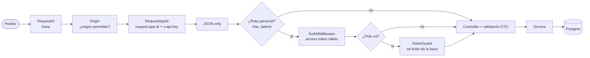

Repositorio `inzumer/milimon-backend-nest` (privado; antes `api-milimon`). NestJS 12 (ESM) + TypeORM + Postgres.

## Cada pedido pasa por

Además hay **límite de pedidos por IP** (120 por minuto; 10 para iniciar sesión) y cabeceras de
seguridad con Helmet.

## Rutas

| Módulo        | Rutas                                                                        | Acceso              |
| ------------- | ---------------------------------------------------------------------------- | ------------------- |
| auth          | `POST /auth/google`, `/auth/facebook`, `/auth/refresh`, `/auth/sign-out`     | Cliente (api key)   |
| auth          | `POST /auth/facebook/data-deletion`                                          | Meta (firma propia) |
| user          | `GET /me`, `DELETE /me`, `GET/PUT /me/profile`                               | Sesión              |
| drafts        | `GET /me/drafts`, `PUT/DELETE /me/drafts/:formulaId`                         | Sesión              |
| history       | `GET /me/history`, `PUT/DELETE /me/history/:id`                              | Sesión              |
| saved-recipes | `GET /me/saved-recipes`, `PUT/DELETE /me/saved-recipes/:recipeId`            | Sesión              |
| admin         | `GET /admin/users`, `PATCH /admin/users/:id/role`, `GET /admin/role-changes` | Rol admin           |
| agenda        | `GET/POST /admin/agenda`, `PATCH/DELETE /admin/agenda/:id`                   | Rol editor o admin  |
| health        | `GET /health`                                                                | Público (Render)    |

## Reglas

- Todo lo personal se consulta **siempre con el id del token**, nunca con uno que mande el cliente.
- Esquema solo por **migraciones** escritas a mano y reversibles; corren al arrancar.
- Lo que pertenece a una persona se borra con su cuenta (`ON DELETE CASCADE`); en la agenda y el
  registro de roles, quien hizo el cambio queda en `null`.
- Límites, TTLs y patrones en `src/common/constants`.
