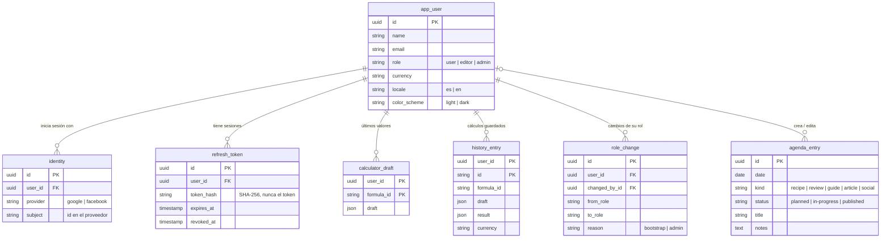

## Base de datos (Postgres)

- Una persona puede tener **Google y Facebook** vinculados: se unen por el email verificado.
- De los refresh tokens se guarda solo el **hash**; cada uno se usa una vez.
- Al borrar la cuenta se borra todo lo suyo; en `role_change` y `agenda_entry`, quien hizo el cambio
  queda en `null`.

## En el dispositivo (localStorage)

| Clave                  | Contenido                                                     |
| ---------------------- | ------------------------------------------------------------- |
| `milimon:settings`     | Moneda, idioma, tema y consentimiento de analítica            |
| `milimon:calculations` | Últimos valores de cada calculadora                           |
| `milimon:history`      | Cálculos guardados (hasta 15)                                 |
| `milimon:auth`         | Access token, refresh token, vencimiento y datos de la cuenta |

En `sessionStorage`, `milimon:account-synced` marca que en esta pestaña ya se sincronizó al
iniciar sesión.
