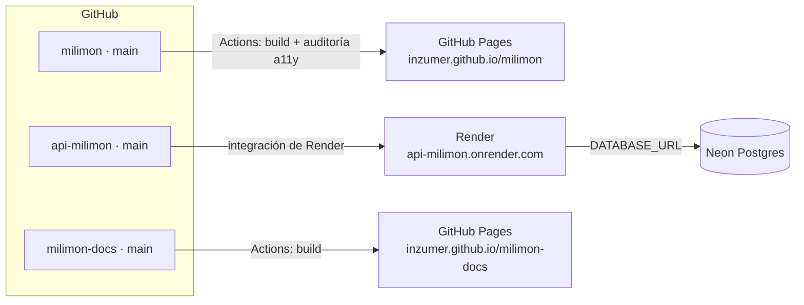

## Sitio · GitHub Pages

- Se publica con cada push a `main` (`pages.yml`) o a mano.
- Variables públicas del repo (terminan en el bundle): `PUBLIC_API_URL`, `PUBLIC_API_KEY`,
  `PUBLIC_API_APP_ID`, `PUBLIC_GOOGLE_CLIENT_ID`, `PUBLIC_FACEBOOK_APP_ID`, `PUBLIC_GTM_ID`.

## API · Render

- Se crea una vez desde el **Blueprint** (`render.yaml`): Dashboard → New → Blueprint → repo.
- Render despliega `main` solo, y las migraciones corren al arrancar.
- Variables secretas que se cargan a mano: `DATABASE_URL` (Neon), `BOOTSTRAP_ADMIN_EMAILS`,
  `FACEBOOK_APP_ID`, `FACEBOOK_APP_SECRET`. `JWT_SECRET` y `SWAGGER_API_KEY` los genera Render.
- En el plan free se duerme sin uso: el primer pedido tarda unos segundos (el sitio reintenta).

## Base de datos · Neon

- Proyecto `api-milimon`; la cadena de conexión va en `DATABASE_URL` con `DB_SSL=true`.

## Google y Facebook

- **Google Cloud** → credencial OAuth "Web": los **orígenes autorizados** tienen que incluir
  `https://inzumer.github.io` (y el dominio propio cuando exista). Sin eso, el botón de Google falla.
- **Meta**: la app de Facebook Login, con el callback de borrado de datos apuntando a la API.

## Cuándo sale cada cosa

Ver [Releases](/milimon-docs/como-funciona/releases/): el sitio y la API se publican los lunes al
mediodía (Madrid) desde el PR de release que se arma el viernes.
