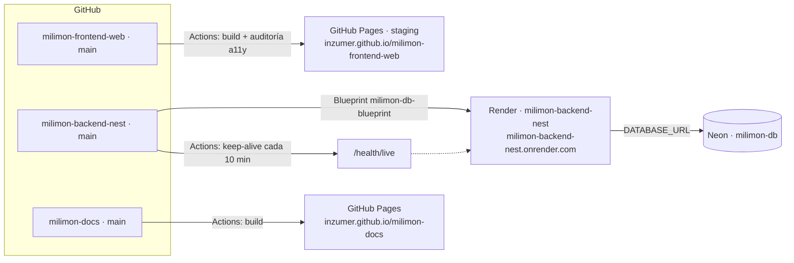

## Sitio · GitHub Pages (staging)

- Es el **staging** hasta que exista el dominio oficial. Se publica con cada push a `main`
  (`pages.yml`) o a mano.
- Variables públicas del repo (terminan en el bundle): `PUBLIC_API_URL`, `PUBLIC_API_KEY`,
  `PUBLIC_API_APP_ID`, `PUBLIC_GOOGLE_CLIENT_ID`, `PUBLIC_FACEBOOK_APP_ID`, `PUBLIC_GTM_ID` y,
  para el entorno Staging de GTM, `PUBLIC_GTM_AUTH` y `PUBLIC_GTM_PREVIEW`.

## API · Render

- Servicio **`milimon-backend-nest`**, creado desde el Blueprint **`milimon-db-blueprint`**
  (`render.yaml` del repo): Dashboard → New → Blueprint → repo.
- Render despliega `main` solo, y las migraciones corren al arrancar.
- Variables secretas que se cargan a mano: `DATABASE_URL` (Neon), `BOOTSTRAP_ADMIN_EMAILS`,
  `FACEBOOK_APP_ID`, `FACEBOOK_APP_SECRET`. `JWT_SECRET` y `SWAGGER_API_KEY` los genera Render.
- En el plan free se duerme tras 15 minutos sin uso (el primer pedido tarda 30–50 s). El workflow
  **Keep alive** de la API le pega a `/health/live` cada 10 minutos de 8 a 24 h (Madrid), sin
  despertar la base. Render da 750 h/mes para toda la cuenta, compartidas con la API de Zamuner.
- `/health` (con consulta a la base) es el health check de Render.

## Base de datos · Neon

- Proyecto **`milimon-db`**; la cadena de conexión (pooled) va en `DATABASE_URL` con
  `DB_SSL=true`. Se suspende sola sin uso; el keep-alive no la despierta.

## Google y Facebook

- **Google Cloud** → credencial OAuth "Web": los **orígenes autorizados** tienen que incluir
  `https://inzumer.github.io` (y el dominio propio cuando exista). Sin eso, el botón de Google falla.
- **Meta**: la app de Facebook Login, con el callback de borrado de datos apuntando a la API.

## Dominio oficial

Al pasar a producción con dominio propio cambian: el dominio de la API en Render, `CORS_ORIGIN`
y `FRONTEND_URL`, las variables del front, los orígenes de Google, Meta, el entorno Live de GTM y
Search Console. La lista completa está en `docs/DEPLOY.md` de `milimon-backend-nest`
(sección "Moving to the official domain").

## Cuándo sale cada cosa

Ver [Releases](/milimon-docs/como-funciona/releases/): el sitio y la API se publican los lunes al
mediodía (Madrid) desde el PR de release que se arma el viernes.
