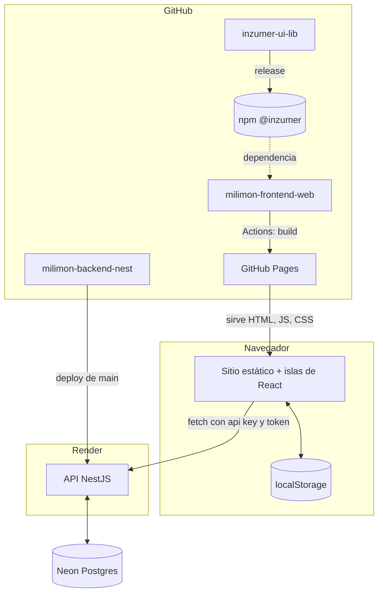

Milimon son tres piezas propias y algunos servicios externos, todos en planes gratuitos.

| Pieza                              | Qué hace                                                    | Dónde vive                                              |
| ---------------------------------- | ----------------------------------------------------------- | ------------------------------------------------------- |
| **Sitio** (`milimon-frontend-web`) | Páginas, calculadoras, cuenta y gestión del sitio           | GitHub Pages (`inzumer.github.io/milimon-frontend-web`) |
| **API** (`milimon-backend-nest`)   | Cuentas, sincronización, roles y agenda                     | Render (plan free)                                      |
| **Base de datos**                  | Perfiles, cálculos guardados, sesiones, roles, agenda       | Neon (Postgres, plan free)                              |
| **Librería** (`@inzumer/ui-lib`)   | Componentes compartidos (botones, modales, cookies…)        | npm, con Storybook                                      |
| Google / Facebook                  | Inicio de sesión (Google Identity Services, Facebook Login) | Externos                                                |
| Google Tag Manager                 | Medición, solo con consentimiento                           | Externo                                                 |

## Cómo se conectan

## Principios

- **Estático primero**: las páginas se generan en el build; solo lo interactivo (calculadoras,
  cuenta, gestión) es JavaScript en el navegador.
- **Sin cuenta también funciona**: invitada o invitado, todo queda en el dispositivo; la cuenta
  suma sincronización entre dispositivos.
- **Costo cero**: GitHub Pages, Render free (se duerme sin uso y tarda unos segundos en despertar),
  Neon free, Google y Facebook sin costo.
- **Seguridad**: CSP estricta en el sitio; en la API, orígenes permitidos, api key por cliente,
  tokens cortos, validación de todo lo que entra y roles leídos de la base en cada pedido.
