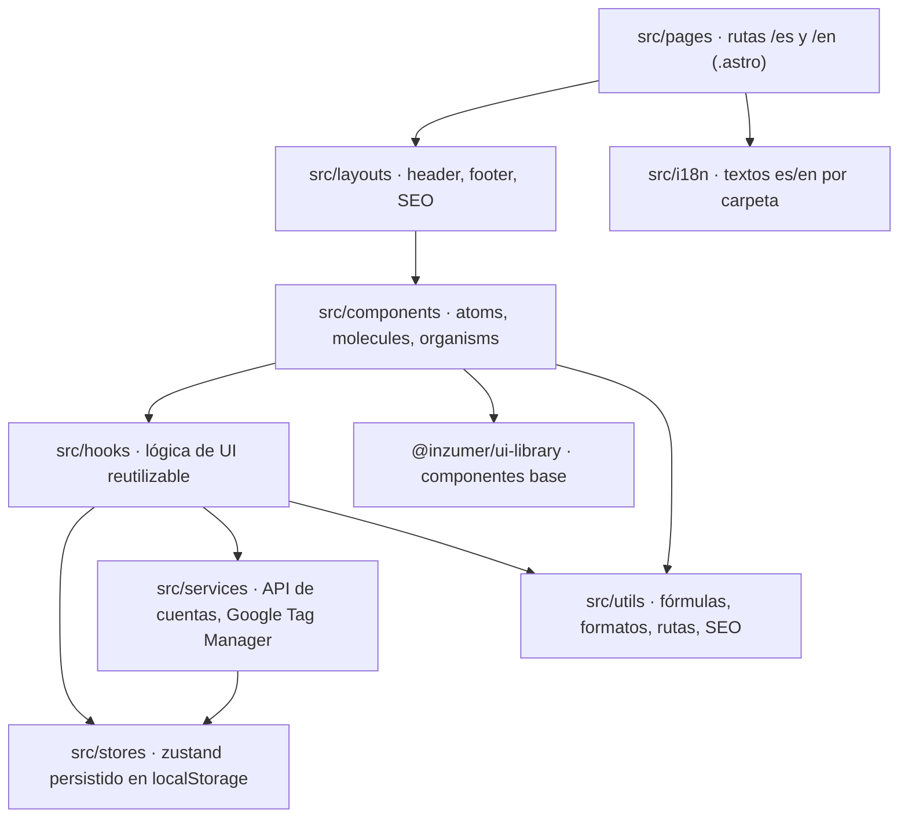

Repositorio [`inzumer/milimon`](https://github.com/inzumer/milimon). Astro genera HTML estático;
React se usa solo en las **islas** interactivas.

## Capas

## Rutas e idiomas

- Siempre con prefijo de idioma y en inglés: `/es/formulas/cooking-loss` ↔ `/en/formulas/cooking-loss`.
- `/` elige el idioma: el que la persona eligió antes, el del navegador o español.
- Textos en `src/i18n/<carpeta>/{es,en}.json`, con las mismas claves en los dos idiomas (lo
  verifica un test).
- Todo se sirve bajo `/milimon` en GitHub Pages: los enlaces se arman con `localizedPath` / `withBase`.

## Estado

| Store      | Qué guarda                                        | Clave en localStorage  |
| ---------- | ------------------------------------------------- | ---------------------- |
| `settings` | Moneda, idioma, tema, consentimiento de analítica | `milimon:settings`     |
| `drafts`   | Últimos valores de cada calculadora               | `milimon:calculations` |
| `history`  | Cálculos guardados (hasta 15)                     | `milimon:history`      |
| sesión     | Tokens y datos de la cuenta                       | `milimon:auth`         |

Con sesión iniciada, cada cambio en esos stores se sube a la API (ver
[Sincronización](/milimon-docs/como-funciona/sincronizacion/)).

## Seguridad del sitio

- **CSP** generada en el build: scripts solo por hash o de orígenes permitidos (Google, Facebook,
  GTM). Un script u origen nuevo se agrega en `astro.config.mjs`.
- Cada elemento interactivo tiene un **id estable** (`trackingId`) para medir clics desde GTM.
