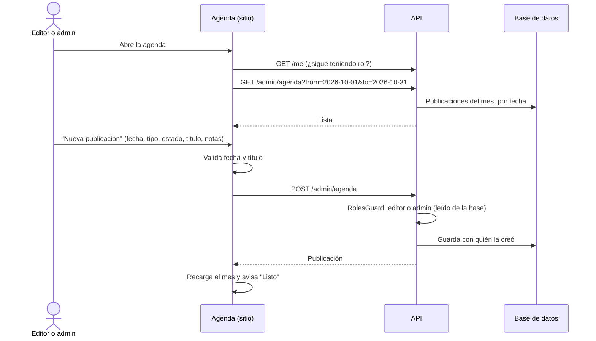

La agenda (`/es/admin/agenda`) es **compartida** entre editores y admins: qué se publica, cuándo,
de qué tipo y en qué estado está.

| Campo   | Valores                                                                |
| ------- | ---------------------------------------------------------------------- |
| Tipo    | Receta, Reseña, Guía, Artículo, Redes                                  |
| Estado  | Planificada → En preparación → Publicada                               |
| Límites | Título hasta 160 caracteres, notas hasta 1000, rango de hasta 400 días |

- Editar (`PATCH`) guarda **quién hizo el último cambio**; borrar pide confirmación.
- Si a alguien le quitan el rol mientras la tiene abierta, el siguiente cambio responde 403 y el
  sitio lo explica.
- El **ritmo sugerido** (1 receta por semana, 1 reseña cada 15 días, 1 guía y 1 artículo por mes)
  se muestra arriba como referencia.
