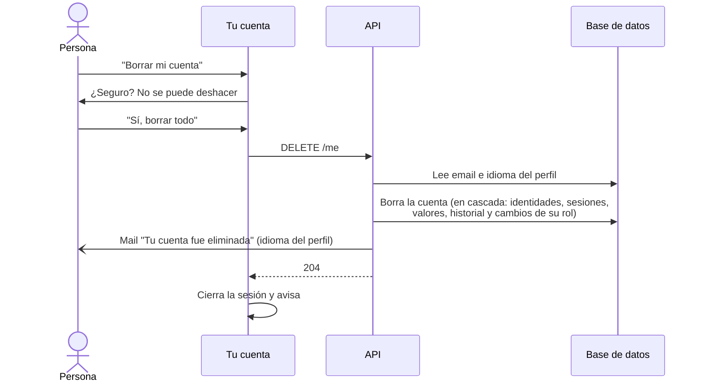
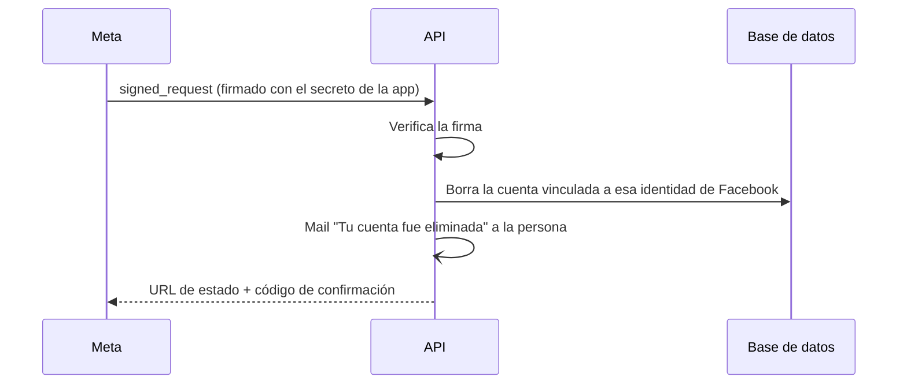

## Desde el sitio

## Desde Facebook

Meta exige un **callback de borrado de datos**: cuando alguien quita la app desde Facebook, Meta
llama a `POST /auth/facebook/data-deletion` con un pedido firmado.

El mail de confirmación sale igual en los dos caminos (ver [Mails](/milimon-docs/como-funciona/mails/)).

- Lo que queda: en la agenda y el registro de roles, "quién hizo el cambio" pasa a `null`.
- Los datos del **dispositivo** (valores, historial local) quedan hasta que la persona los borre o
  limpie el navegador.
