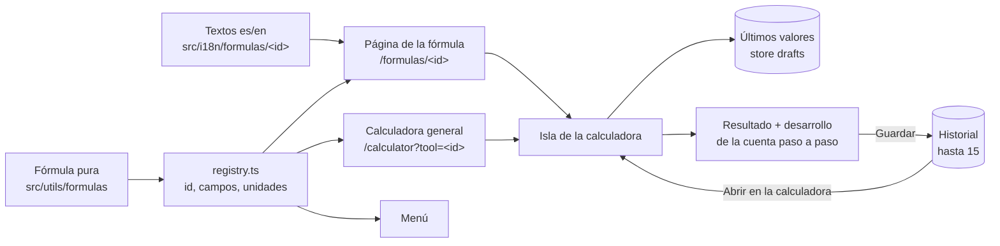

Cada fórmula (desperdicio, factor de desperdicio, merma de cocción, costo de receta, precio de
carta, punto de equilibrio, reglas de Omnes…) se escribe **una sola vez** y de ahí salen el menú,
su página y la calculadora.

## Cómo se calcula

1. La persona escribe los valores; los campos aceptan coma o punto según el idioma y solo números.
2. La fórmula pura recibe números y devuelve el resultado y cada paso intermedio.
3. El resultado se muestra con la **moneda elegida** (solo cambia el símbolo, no convierte).
4. "Probar este ejemplo" carga el ejemplo propio del sitio (el café de barrio).

## Calidad

- Cada fórmula tiene tests con ejemplos resueltos **a mano**, no con el propio código.
- Los ejemplos, números y textos son propios; el material del curso es solo referencia de conceptos.
