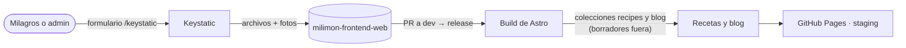

Las recetas y los artículos del blog se editan con **Keystatic**, un CMS que los guarda como archivos
en el repo del sitio. El sitio los lee en el build, así que sigue siendo estático.

| Qué       | Dónde queda                                                                 |
| --------- | --------------------------------------------------------------------------- |
| Recetas   | `src/content/recipes/<dirección>.yaml` y sus fotos en `src/assets/recipes/` |
| Artículos | `src/content/blog/<dirección>/` (datos + texto `content/{es,en}.mdoc`)      |



## Hoy (fase 1): edición en local

- `pnpm dev` y abrir `http://127.0.0.1:4321/keystatic`, o `/keystatic-editor` para editar con la
  vista previa al lado. El panel solo existe en desarrollo: el sitio publicado no lo incluye.
- Cada receta tiene título (la dirección sale del título y se ajusta a mano, en inglés), resumen,
  categoría, tiempo, porciones, foto principal, ingredientes y pasos (con foto opcional).
- Cada artículo tiene título, bajada, fecha, portada opcional, el texto y dos casillas:
  **Destacado** (aparece en la portada del sitio) y **Borrador**.
- Todo va en **español y en inglés**; el inglés es opcional y, si falta, el sitio muestra el
  español. Las fotos llevan su descripción en los dos idiomas.
- **Borrador** viene marcado: nada se publica hasta destildarlo.
- Los cambios quedan como archivos: se suben con un PR a `dev` y salen en el siguiente release.

### Milicitos en un artículo

En el texto de un artículo, **Insertar → Milicitos** agrega una puntuación de 1 a 5 con su texto al
lado (las estrellitas con el nombre accesible "4 de 5 milicitos"). En el archivo queda así:

```md

Muy bueno, lo recomendamos.

```

El artículo [Los milicitos](https://inzumer.github.io/milimon-frontend-web/es/blog/milicitos) usa
uno por cada nivel de la escala.

## Después (fase 2): sin depender de nadie técnico

- El editor online (Cloudflare Pages, sin dominio propio) con Keystatic en modo GitHub: cada
  **Guardar** es un commit a `dev` y staging se actualiza solo.
- Acceso solo para quien edita y vista previa por rama de borrador (ver la
  [sugerencia 02](/milimon-docs/sugerencias/02-cms-y-emails/)).
- Pasar a Keystatic las guías, "Sobre mí" y los textos del inicio que hoy están en `src/i18n`.
