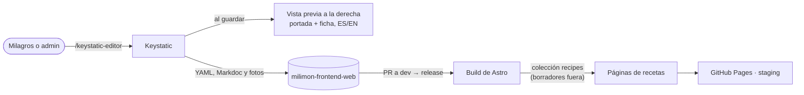

Las recetas y el blog se editan con **Keystatic**, un CMS que guarda todo como archivos en el repo
del sitio: cada receta en `src/content/recipes/<dirección>.yaml` y cada artículo en
`src/content/blog/<dirección>/` (`index.yaml` más `content/es.mdoc` y `content/en.mdoc`). Las fotos
van en `src/assets/`. El sitio los lee en el build, así que sigue siendo estático.

## Hoy (fase 1): edición en local

- `pnpm dev` y abrir `http://127.0.0.1:4321/keystatic-editor`: Keystatic a la izquierda y la
  **vista previa** a la derecha (portada y ficha, o el artículo, en español o inglés), que se
  actualiza al guardar. Solo existe en desarrollo: el sitio publicado no la incluye.
- La **dirección** va arriba de todo y sale del título en inglés (las rutas son en inglés).
- Cada receta tiene títulos (inglés y español), resumen, categoría, tiempo, porciones, foto
  principal, ingredientes y pasos (con foto opcional).
- Todo va en **español y en inglés**; el inglés es opcional y, si falta, el sitio muestra el
  español.
- **Blog**: el texto admite títulos de sección, negrita, cursiva, listas, citas, enlaces e
  **imágenes en cualquier lugar**. Los títulos se ven como `h2`/`h3` y los párrafos como `p2`
  (ver [Tipos de texto](#tipos-de-texto)).
- **Borrador** viene marcado: nada se publica hasta destildarlo.
- Los cambios quedan como archivos: se suben con un PR a `dev` y salen en el siguiente release.

## Después (fase 2): sin depender de nadie técnico

Con el deploy en Cloudflare Pages:

- **Keystatic Cloud** (plan gratuito): Milagros entra con su email, sube fotos desde el celular y
  publica con un botón; cada publicación es un commit en el repo.
- Acceso solo para admins y vista previa por rama de borrador (ver la
  [sugerencia 02](/milimon-docs/sugerencias/02-cms-y-emails/)).
- Pasar a Keystatic el artículo actual del blog, las guías, "Sobre mí" y los textos del inicio que
  hoy están en `src/i18n`.

## Tipos de texto

Los textos del sitio usan `RichText` de la librería, con estas variantes:

| Variante  | Qué es                                           | Dónde                                          |
| --------- | ------------------------------------------------ | ---------------------------------------------- |
| `h1`      | Título de la página (uno por página)             | Título de receta o artículo                    |
| `h2`      | Sección                                          | "Ingredientes", títulos de sección del blog    |
| `h3`      | Subsección                                       | Subtítulos del blog, títulos dentro de paneles |
| `s1`–`s2` | Rótulos destacados, no son títulos del documento | Título de una card, grupos de menú             |
| `s3`–`s4` | Rótulos chicos                                   | Chips (categoría, tiempo), avisos cortos       |
| `p1`      | Bajada o introducción                            | La bajada debajo del título                    |
| `p2`      | Texto de lectura (por defecto)                   | Párrafos del blog y de las páginas             |
| `p3`      | Texto secundario                                 | Fechas, notas                                  |
| `p4`      | Letra chica                                      | Aclaraciones legales                           |

En el editor, Milagros elige "Título" o "Subtítulo" y el sitio aplica `h2` o `h3`; el `h1` lo pone
la página con el título de la receta o del artículo.
