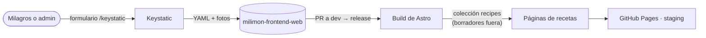

Las recetas se editan con **Keystatic**, un CMS que guarda cada receta como un archivo YAML en el
repo del sitio (`src/content/recipes/<dirección>.yaml`) y sus fotos en `src/assets/recipes/`. El
sitio las lee en el build, así que sigue siendo estático.

## Hoy (fase 1): edición en local

- `pnpm dev` y abrir `http://127.0.0.1:4321/keystatic`. El panel solo existe en desarrollo: el sitio
  publicado no lo incluye.
- Cada receta tiene título (la dirección sale del título y se ajusta a mano, en inglés), resumen,
  categoría, tiempo, porciones, foto principal, ingredientes y pasos (con foto opcional).
- Todo va en **español y en inglés**; el inglés es opcional y, si falta, el sitio muestra el
  español.
- **Borrador** viene marcado: una receta solo se publica cuando se destilda.
- Los cambios quedan como archivos: se suben con un PR a `dev` y salen en el siguiente release.

## Después (fase 2): sin depender de nadie técnico

Con el deploy en Cloudflare Pages:

- **Keystatic Cloud** (plan gratuito): Milagros entra con su email, sube fotos desde el celular y
  publica con un botón; cada publicación es un commit en el repo.
- Acceso solo para admins y vista previa por rama de borrador (ver la
  [sugerencia 02](/milimon-docs/sugerencias/02-cms-y-emails/)).
- Pasar a Keystatic el blog, las guías, "Sobre mí" y los textos del inicio que hoy están en
  `src/i18n`.
