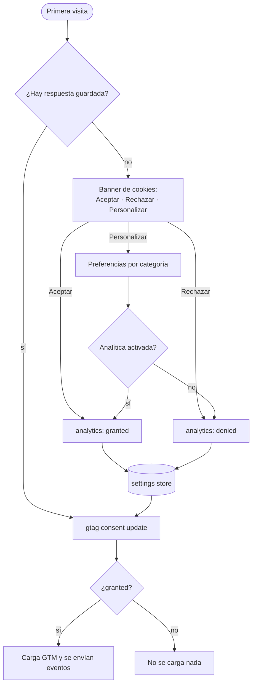

Nada de medición se carga **antes** de que la persona acepte. El banner solo aparece si el sitio
tiene configurado `PUBLIC_GTM_ID`.

- **Consent Mode v2**: por defecto todo está en `denied`; con la respuesta se hace
  `gtag('consent', 'update', …)`.
- La respuesta se puede cambiar en cualquier momento: "Preferencias de cookies" en el footer o el
  switch de la página de privacidad.
- Los eventos (`menu_opened`, `language_changed`, `page_shared`, `sign_out`…) pasan siempre por
  `track()`; cada elemento interactivo tiene un id estable para usar como disparador en GTM.
- En la librería, banner, preferencias y ajustes en página son un solo componente,
  **`CookieConsent`**, con los modos `banner`, `modal` e `inline` (desde `@inzumer/ui-library` 2.0.0).
