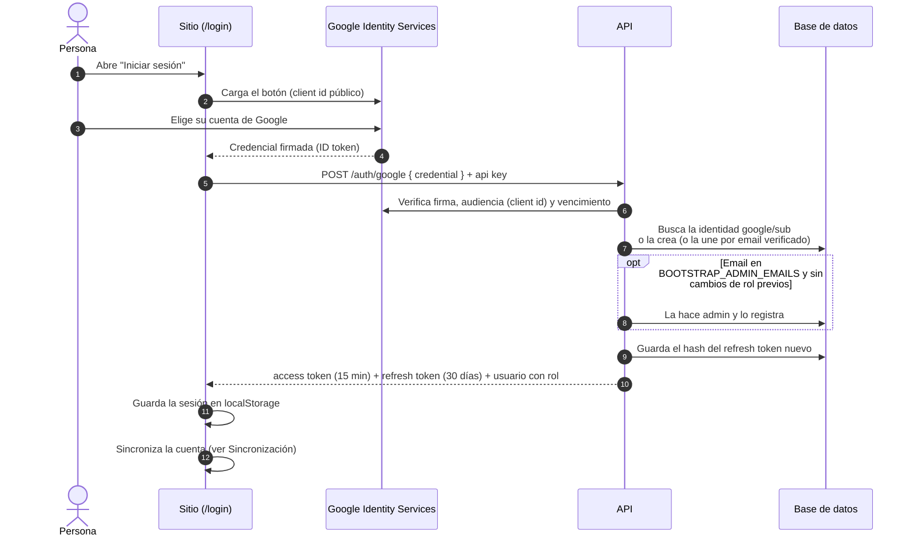

El sitio nunca ve contraseñas: Google o Facebook confirman quién es la persona y la API emite
una sesión propia.

## Con Google

- **Facebook** sigue el mismo camino con `POST /auth/facebook` (token de Facebook Login, que la
  API valida contra Graph API). El botón está deshabilitado hasta que exista la app de Meta.
- Si la persona ya tenía cuenta con el otro proveedor y el **mismo email verificado**, se vincula
  a esa cuenta en lugar de crear otra.

## Qué tiene que estar configurado

| Dónde        | Qué                                                                         | Si falta                                       |
| ------------ | --------------------------------------------------------------------------- | ---------------------------------------------- |
| Google Cloud | Credencial OAuth web con `https://inzumer.github.io` como origen autorizado | El botón muestra un error de origen            |
| Sitio        | `PUBLIC_GOOGLE_CLIENT_ID` y `PUBLIC_API_URL` (variables del repo)           | No aparece el botón o no hay cuentas           |
| API (Render) | El servicio creado, con `GOOGLE_CLIENT_ID` y `CORS_ORIGIN`                  | Google responde bien pero la sesión no se crea |

:::caution[Estado al 28/09/2026]
La API todavía **no está creada en Render** (el dominio responde `no-server`): por eso el inicio de
sesión no termina. Ver los pasos en [Despliegue](/milimon-docs/arquitectura/despliegue/).
:::
