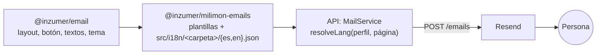

:::caution[Pendiente: dominio propio]
Todavía no hay dominio propio, así que Resend no está configurado y **no sale ningún mail**. Cuando
exista el dominio: verificarlo en Resend (SPF, DKIM, DMARC) y cargar `RESEND_API_KEY` y `EMAIL_FROM`
en Render.
:::

La API manda dos mails transaccionales con [Resend](https://resend.com). No hay newsletter ni
mails de marketing.

| Mail                    | Cuándo                                               | Idioma                                              |
| ----------------------- | ---------------------------------------------------- | --------------------------------------------------- |
| Bienvenida              | Se crea una cuenta (primer inicio de sesión)         | El del perfil; si todavía no tiene, el de la página |
| Tu cuenta fue eliminada | Se borra la cuenta (desde el sitio o desde Facebook) | El del perfil                                       |

Si no hay idioma válido, se usa español.

## Cómo se arman

- **`inzumer-email`** (`@inzumer/email`): piezas genéricas de React Email (layout, título, texto,
  botón, tarjeta y pie), reutilizables en otros proyectos.
- **`milimon-emails-react`** (`@inzumer/milimon-emails`): las plantillas de Milimon con los colores
  de la marca. Los textos están en `src/i18n/<carpeta>/{es,en}.json`, igual que en el sitio, con
  las mismas claves en los dos idiomas.
- **API** (`milimon-backend-nest`, módulo `mail`): elige el idioma con `resolveLang`, renderiza HTML
  y texto plano y los manda. Un mail que falla queda en el log y **nunca frena** el inicio de sesión
  ni el borrado.

## Configuración

| Variable (Render) | Qué es                                       |
| ----------------- | -------------------------------------------- |
| `RESEND_API_KEY`  | Clave de Resend con permiso solo de envío    |
| `EMAIL_FROM`      | Remitente de un dominio verificado en Resend |

Si falta alguna de las dos, no se manda nada y la API registra "Email skipped".

Para ver las plantillas en local: `pnpm preview` en `milimon-emails-react` (`http://localhost:3030`).
