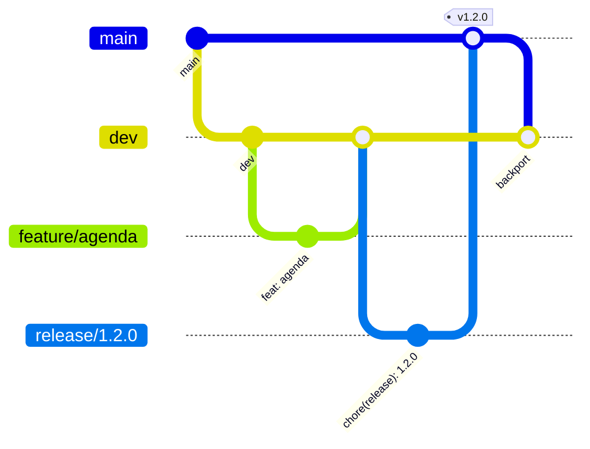
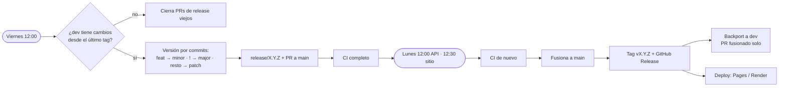

## Ramas

- `feature/*` sale de `dev` y vuelve con un PR (merge `--no-ff`).
- `main` solo recibe `release/*` y `hotfix/*`, y es lo que se publica.
- Commits y títulos de PR con **Conventional Commits** (`feat`, `fix`, `docs`, `ci`…).

## Release automático (hora de Madrid)

- Si hay conflicto en el backport, el PR queda abierto para resolverlo a mano.
- Con `RELEASE_AUTO_MERGE=false` (variable del repo), el lunes no se fusiona solo: el PR queda para
  revisarlo, y al fusionarlo a mano igual se hacen el tag, el release y el backport.
- **Dependabot** abre PRs los días 1 y 15 de cada mes.
- Se puede lanzar cualquier paso a mano desde **Actions** (el viernes permite forzar el tipo de versión).
