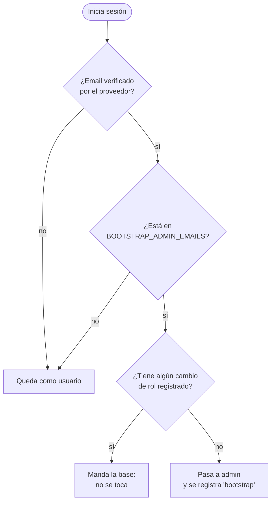
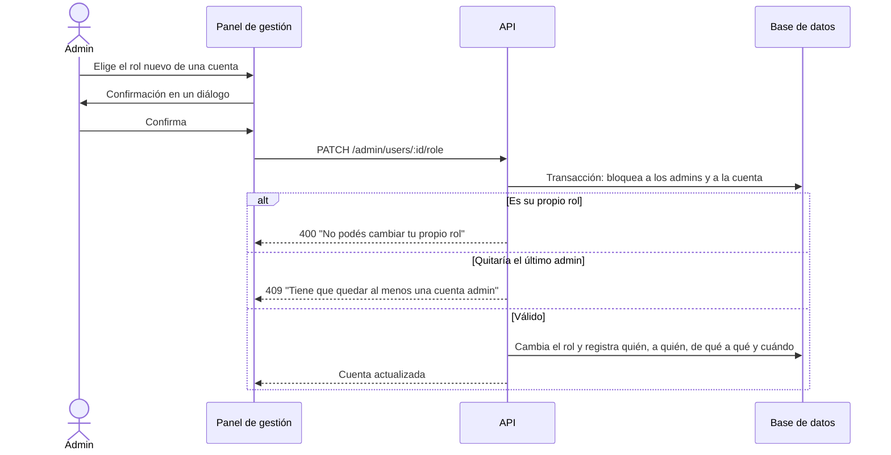

| Rol         | Puede                                                                        |
| ----------- | ---------------------------------------------------------------------------- |
| **Usuario** | Usar el sitio y su cuenta (todas las personas empiezan así)                  |
| **Editor**  | Lo anterior + **Gestión del sitio**: agenda, guía de fotos, sugerencias, CMS |
| **Admin**   | Lo anterior + ver cuentas y cambiar roles                                    |

La **fuente de verdad es la base de datos**: la API vuelve a leer el rol en cada pedido de
administración, así que un cambio aplica en el momento.

## El primer admin

Sacar un email de la variable **no le quita el rol a nadie**: desde el primer cambio, todo se
maneja desde el panel.

## Cambiar un rol

- En el sitio, el menú **Gestión del sitio** y el zócalo **Modo gestión** aparecen solo para
  editores y admins.
