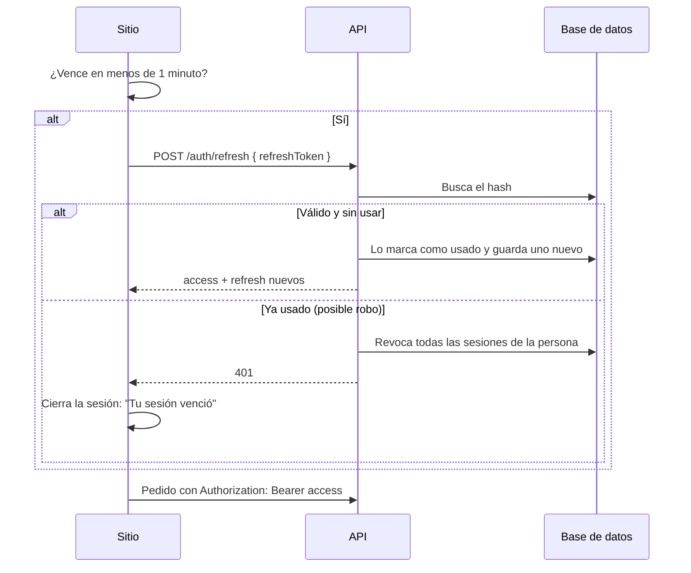
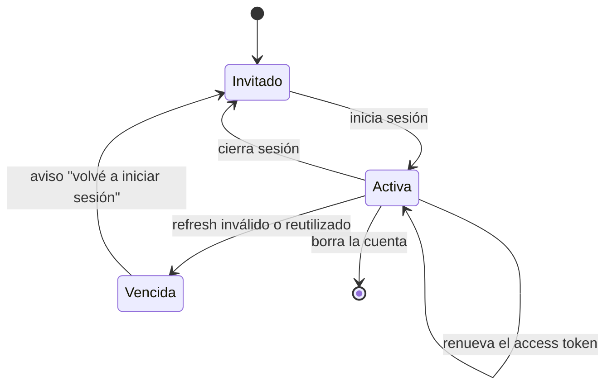

| Token             | Dura    | Para qué                                     | Dónde se guarda                       |
| ----------------- | ------- | -------------------------------------------- | ------------------------------------- |
| **Access token**  | 15 min  | Autoriza cada pedido a `/me` y `/admin`      | Dispositivo (`milimon:auth`)          |
| **Refresh token** | 30 días | Pide un access token nuevo, **una sola vez** | Dispositivo; en la base, solo su hash |

## Renovación

- Varios pedidos a la vez comparten **una sola renovación**.
- Errores temporales (408, 429, 5xx) se reintentan hasta **3 veces** con espera creciente; útil
  cuando Render está despertando.
- **Cerrar sesión** revoca el refresh token en la API y borra la sesión del dispositivo; los datos
  quedan en la cuenta.

## Estados de la sesión

