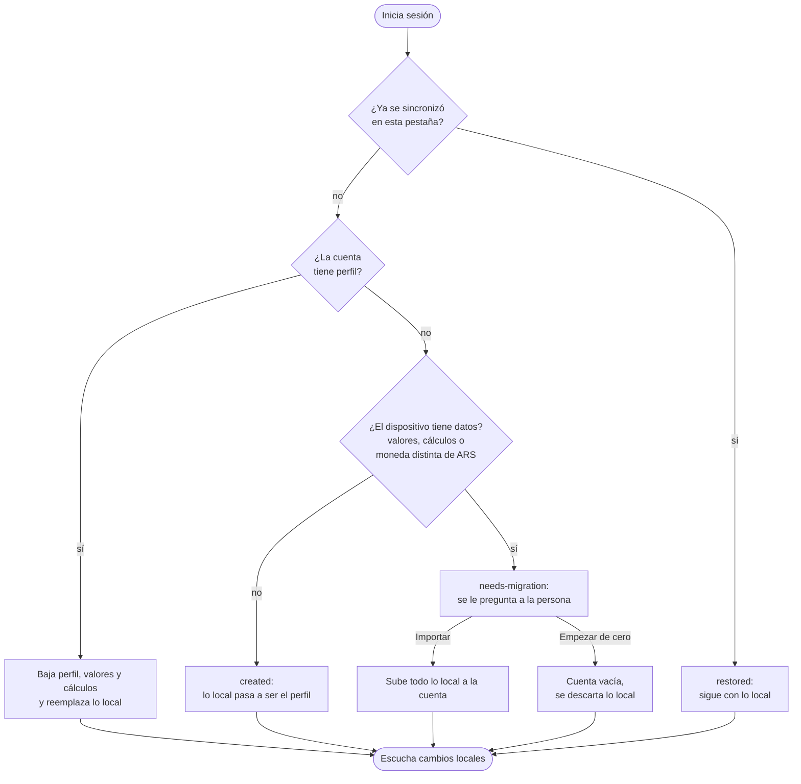
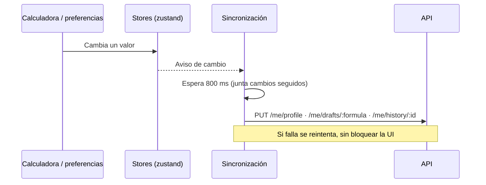

La interfaz siempre lee de los **stores locales** (rápido y sin conexión). Con sesión iniciada, la
cuenta es la fuente de verdad y los cambios se suben solos.

## Al iniciar sesión

## Mientras la sesión está abierta

- **Moneda, idioma y tema** → perfil. **Valores de cada calculadora** → borradores.
  **Cálculos guardados** → historial (hasta 15).
- Al **cerrar sesión**, el dispositivo vuelve al modo invitado sin los datos de la cuenta.
