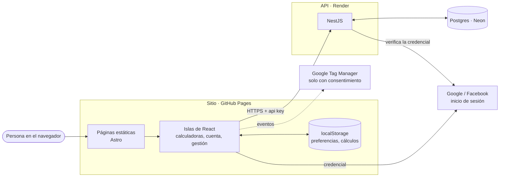

import { CardGrid, LinkCard } from '@astrojs/starlight/components';

**Milimon** es un manual de estudio y un conjunto de calculadoras de costos gastronómicos
(desperdicio, merma, costo de recetas, precio de carta, punto de equilibrio…), en español e
inglés, más una sección de recetas y un blog. Este sitio documenta **cómo funciona**: para el
equipo, para quien edite el contenido y para quien desarrolle.

## El sistema en una imagen

- El **sitio** es estático: funciona sin cuenta, y todo lo que se carga queda en el dispositivo.
- La **API** solo hace falta para las cuentas: guardar preferencias y cálculos, sincronizar
  dispositivos, roles y la agenda de publicaciones.
- **Medición** con Google Tag Manager, que no carga nada hasta que la persona acepta las cookies.

<CardGrid>
  <LinkCard
    title="Arquitectura"
    description="Sitio, API, datos y despliegue."
    href="arquitectura/sistema/"
  />
  <LinkCard
    title="Cómo funciona"
    description="Cada flujo con su diagrama: sesión, sincronización, roles…"
    href="como-funciona/inicio-de-sesion/"
  />
  <LinkCard
    title="Guías"
    description="Para quien gestiona el sitio: agenda, roles y contenido."
    href="guias/gestion-del-sitio/"
  />
  <LinkCard
    title="Desarrollo"
    description="Repositorios, convenciones y releases."
    href="desarrollo/repositorios/"
  />
  <LinkCard title="Plan" description="Qué está hecho y qué falta." href="plan/" />
  <LinkCard title="Sugerencias" description="Ideas y análisis por tema." href="sugerencias/" />
</CardGrid>
